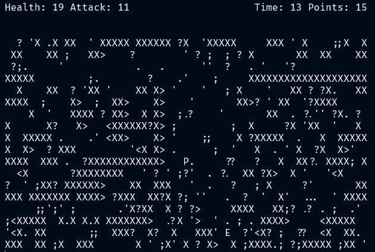

# Console Game Project

## Overview
This is a simple console-based game written in C. It features a custom rendering system to display graphics in the terminal and provides basic gameplay mechanics, including player movement and collision detection. The project is designed to demonstrate fundamental game development concepts in a minimalistic way.



## Features
- Custom ASCII-based rendering system
- Basic player movement and interaction
- Simple collision detection
- Smooth game loop with real-time input handling
- Lightweight and efficient console-based execution

## Gameplay Elements
- The player (P) is always centered on the screen and navigates the world by shifting the game environment around them.
- Collectible items (., ,, ;) provide points when picked up.
- Walls (X) act as barriers that the player and enemies cannot pass through, shaping the level's layout.
- Traps (>, <) are static hazards that cause penalties or game over if touched.
- Enemies (E) move within the game world. If the player collides with an enemy, a combat sequence is initiated.
- Combat System: When the player and an enemy cross paths, a battle begins, similar to classic arcade fighting games. The player must engage in a turn-based or reaction-based duel to defeat the enemy and continue exploring.

## Installation & Compilation
Clone the repository:
```sh
git clone https://github.com/wooodiest/SwordsAndSandals
```
### Controls
- `W` - Move up
- `S` - Move down
- `A` - Move left
- `D` - Move right
- `Q` - Quit the game
